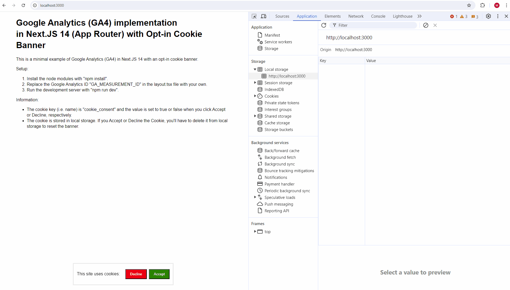

# Google Analytics (GA4) implementation in Next.JS 14 (App Router) with Opt-in Cookie Banner

This is a minimal example of Google Analytics (GA4) in Next.JS 14 with an opt-in cookie banner.
You can see it at the bottom of the screen :)

## Setup

1. Install the node modules with `npm install`.
2. Replace the Google Analytics ID `GA_MEASUREMENT_ID` in the `layout.tsx` file with your own.
3. Run the development server with `npm run dev`.

## Information

- The cookie key (i.e., name) is `cookie_consent` and the value is set to `true` or `false` when you click Accept or Decline, respectively.
- The cookie is stored in local storage. If you Accept or Decline the Cookie, you'll have to delete it from local storage to reset the banner.

## Demo

